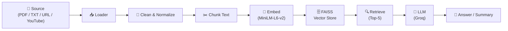

<div align="center">

# 🤖 Universal Document Intelligence — Multi-Source RAG App

**Extract insights, generate summaries, and ask questions from PDFs, text files, websites, and YouTube videos.**

[](https://python.org)
[](https://streamlit.io)
[](https://langchain.com)
[](https://github.com/facebookresearch/faiss)
[](https://groq.com)
[](LICENSE)
[](https://huggingface.co/spaces/Pranotosh2/multi-rag)

</div>

---

## 📸 Application Preview


---

## 🚀 Features

| Category | Details |
|----------|---------|
| **📄 Multi-Source Ingestion** | Upload **PDFs**, **Text files (.txt)**, paste **Website URLs**, or **YouTube video links** |
| **🧹 Text Preprocessing** | Automatic cleaning — removes URLs, emails, timestamps, speech fillers, and special characters; Unicode normalization |
| **✂️ Smart Chunking** | Configurable `RecursiveCharacterTextSplitter` / `CharacterTextSplitter` (1 000 tokens, 200 overlap) |
| **🧠 Embeddings** | `sentence-transformers/all-MiniLM-L6-v2` via Hugging Face |
| **🔍 Vector Search** | FAISS similarity search (top-k = 5) for context retrieval |
| **🤖 LLM** | **Groq**-hosted `openai/gpt-oss-120b` for fast inference |
| **❓ Q&A** | Context-aware question answering with a RAG chain |
| **📘 Summarization** | Comprehensive document summarization chain |
| **🎨 UI** | Professional Streamlit interface with sidebar controls and two-column layout |
| **🐳 Deployment** | Docker & Render-ready with included `Dockerfile` and `render.yaml` |

---

## 🏗️ Project Structure

```
Multi-Source-RAG-App/
│
├── app.py                     # Streamlit UI — page config, sidebar, Q&A / summary panels
├── process.py                 # Document processing pipeline (load → split → clean)
├── qna.py                     # RAG chains — Q&A (FAISS retriever) & summarization
│
├── loader/
│   └── loader.py              # Source loaders: PDF, Text, Web (BeautifulSoup), YouTube transcript
│
├── embeddings/
│   └── embedding.py           # HuggingFace embedding model wrapper
│
├── requirements.txt           # Python dependencies
├── Dockerfile                 # Container image (python:3.11-slim)
├── .env                       # Environment variables (not committed)
├── LICENSE                    # Apache 2.0
└── README.md
```

---

## 🧠 How It Works



1. **Load** — Content is ingested from PDF, plain text, website, or YouTube transcript.
2. **Clean** — Text is normalized (Unicode NFKD), lowercased, and stripped of noise (URLs, emails, timestamps, fillers, special characters).
3. **Chunk** — Documents are split into 1 000-character chunks with 200-character overlap using LangChain splitters.
4. **Embed** — Each chunk is embedded with `all-MiniLM-L6-v2` (384-dim vectors).
5. **Store** — Embeddings are indexed in an in-memory FAISS vector store.
6. **Retrieve** — For Q&A, the top-5 most similar chunks are retrieved.
7. **Generate** — The retrieved context (or full text for summaries) is passed to the Groq-hosted LLM to produce the final answer or summary.

---

## ⚡ Quick Start

### Prerequisites

- **Python 3.11+**
- A **Groq API key** → [console.groq.com](https://console.groq.com)

### 1. Clone the repository

```bash
git clone https://github.com/pranotosh2/Multi-Source-RAG-App.git
cd Multi-Source-RAG-App
```

### 2. Create & activate a virtual environment

```bash
conda create -n rag python=3.11 -y
conda activate rag
```

### 3. Install dependencies

```bash
pip install -r requirements.txt
```

### 4. Configure environment variables

Create a `.env` file in the project root:

```env
GROQ_API_KEY=gsk_xxxxxxxxxxxxxxxxxxxxx
```

### 5. Run the application

```bash
streamlit run app.py
```

The app will open at **http://localhost:8501**.

---

## 🐳 Docker

```bash
# Build
docker build -t multi-source-rag .

# Run
docker run -p 8501:8501 --env-file .env multi-source-rag
```

---

## 🧩 Tech Stack

| Layer | Technology |
|-------|-----------|
| **Frontend** | Streamlit |
| **LLM Orchestration** | LangChain |
| **LLM Provider** | Groq (`openai/gpt-oss-120b`) |
| **Embeddings** | Sentence Transformers (`all-MiniLM-L6-v2`) |
| **Vector Store** | FAISS (CPU) |
| **Document Loaders** | PyPDFLoader, TextLoader, WebBaseLoader, YouTube Transcript API |
| **Text Parsing** | BeautifulSoup, lxml |
| **Containerization** | Docker |
| **Deployment** | Docker / Hugging Face Spaces |

---

## 📄 License

This project is licensed under the **Apache License 2.0** — see the [LICENSE](LICENSE) file for details.

---

<div align="center">

**Built with ❤️ using LangChain, Groq & Streamlit**

</div>
