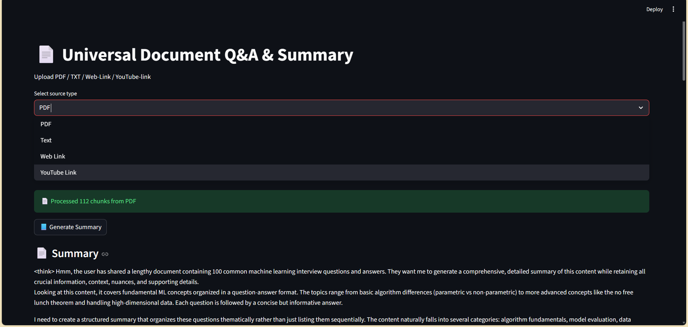

# 📄 RAG-based Question Answering & Summarization App

A **Retrieval-Augmented Generation (RAG)** application built using **LangChain, Hugging Face LLMs, FAISS, and Streamlit**.  
This app allows users to upload or provide content from **PDFs, Text files, Web URLs, or YouTube links**, clean and process the content, and perform **question answering and summarization**.
---
# 📸 Application Preview



# 🚀 Features

- 📄 Upload **PDF** documents  
- 📝 Upload **Text (.txt)** files  
- 🌐 Paste **Website URLs**  
- 🎥 Paste **YouTube video links** (automatic transcript extraction)  
- 🧹 Automatic text cleaning & normalization  
- ✂️ Smart chunking using LangChain splitters  
- 🧠 Hugging Face embeddings  
- 🔍 FAISS vector store for similarity search  
- ❓ Context-aware Question Answering  
- 📘 Large document summarization  
- 🎨 Styled Streamlit UI  
---
# 🏗️ Project Structure
```
LangChain/
│
├── app.py                     # Streamlit application
├── qna.py                     # Q&A and summarization chains
├── process.py                 # File processing logic
│
├── loader/
│   └── loader.py              # PDF / Text / Web / YouTube loaders & cleaners
│
├── embeddings/
│   └── embedding.py           # Embedding model loader
│
│
├── requirements.txt
├── README.md
└── .gitignore
---
```
# 🧠 Tech Stack

- Python  
- Streamlit  
- LangChain  
- Hugging Face Inference API  
- FAISS  
- Sentence Transformers  
- YouTube Transcript API  

---

# 1️⃣ Clone the repository
```bash
git clone https://github.com/pranotosh2/Multi-Source-RAG-App.git
cd REPO_NAME

2️⃣ Create virtual environment
conda create -n rag python=3.11
conda activate rag

3️⃣ Install dependencies

pip install -r requirements.txt
```
# 🔑 Environment Variables

Create a .env file:

HUGGINGFACEHUB_API_TOKEN=hf_xxxxxxxxxxxxxxxxxxxxx

▶️ Run the Application
```bash
streamlit run app.py
```
🧩 How It Works
1.Load content (PDF / Text / Web / YouTube)
2. Clean and normalize text
3. Split text into chunks
4. Generate embeddings
5. Store vectors in FAISS
6. Retrieve relevant chunks
7. Generate answer or summary using LLM
---
## 👨‍💻 Author
Developed as a portfolio-ready NLP & RAG project using modern LLM tooling.
